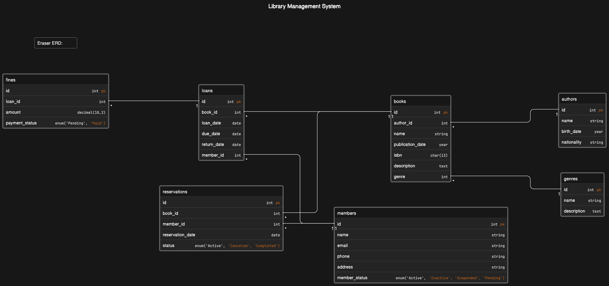

# Design Document

By [Hüsam](https://github.com/husamahmud?tab=overview&from=2023-12-01&to=2023-12-03).

## Scope

The purpose of the database is to manage a library system. It will store
information about books, authors, genres, library members, loans, reservations,
and fines.

The entities included in the scope of the database are:

- **_Books_**: Represents individual books in the library. It includes
  attributes such
  as ID, name, author ID, publication date, ISBN, genre, and description.
- **_Authors_**: Represents the authors of the books. It includes attributes
  like ID,
  name, birthdate, and nationality.
- **_Genres_**: Represents the genres or categories to which the books belong.
  It
  includes attributes like ID, name, and description.
- **_Members_**: Represents the library members or patrons. It includes
  attributes
  like
  ID, name, email, phone, address, and member status.
- **_Loans_**: Represents the loans made by the members. It includes attributes
  like
  ID,
  book ID, member ID, loan date, due date, and return date.
- **_Reservations_**: Represents the book reservations made by the members. It
  includes
  attributes like ID, book ID, member ID, reservation ID, pickup date, and
  status.
- **_Fines_**: Represents the fines imposed on members for late returns. It
  includes
  attributes like ID, loan ID, amount, and payment status.

## Functional Requirements

- Add, update, and delete books, authors, genres, members, loans, reservations,
  and fines.
- Search for books by various criteria such as title, author, genre, etc.
- Check the availability of books for loan or reservation.
- Register new members and manage their membership status.
- Record loan transactions, including due dates and return dates.
- Manage book reservations, including pickup dates and cancellation.
- Track and manage fines imposed on members for late returns.

## Representation

### Entities

The entities represented in the database are:

1. Books:

    - Attributes: ID (auto-incremented), name, author ID, publication date,
      ISBN, genre, description.
    - Types: ID (INT), name (VARCHAR), author ID (INT), publication date (
      YEAR), ISBN (CHAR), genre (INT), description (TEXT).
    - Constraints: Primary key on ID, foreign key referencing authors table on
      author ID, foreign key referencing genres table on genre.

2. Authors:

    - Attributes: ID (auto-incremented), name, birthdate, nationality.
    - Types: ID (INT), name (VARCHAR), birthdate (YEAR), nationality (
      VARCHAR).
    - Constraints: Primary key on ID.

3. Genres:

    - Attributes: ID (auto-incremented), name, description.
    - Types: ID (INT), name (VARCHAR), description (TEXT).
    - Constraints: Primary key on ID.
4. Members:
    - Attributes: ID (auto-incremented), name, email, phone, address, member
      status.
    - Types: ID (INT), name (VARCHAR), email (VARCHAR), phone (VARCHAR),
      address (VARCHAR), member status (ENUM).
    - Constraints: Primary key on ID, unique constraint on email and phone.
5. Loans:
    - Attributes: ID (auto-incremented), book ID, member ID, loan date, due
      date, return date.
    - Types: ID (INT), book ID (INT), member ID (INT), loan date (DATE), due
      date (DATE), return date (DATE).
    - Constraints: Primary key on ID, foreign key referencing books table on
      book ID, foreign key referencing members table on member ID.
6. Reservations:
    - Attributes: ID (auto-incremented), book ID, member ID, reservation ID,
      pickup date, status.
    - Types: ID (INT), book ID (INT), member ID (INT), reservation ID (INT),
      pickup date (DATE), status (ENUM).
    - Constraints: Primary key on ID, foreign key referencing books table on
      book ID, foreign key referencing members table on member ID.

7. Fines:
    - Attributes: ID (auto-incremented), loan ID, amount, payment status.
    - Types: ID (INT), loan ID (INT), amount (DECIMAL), payment status (
      ENUM).
    - Constraints: Primary key on ID, foreign key referencing loans table on
      loan ID.

### Relationships

## Optimizations

The following optimizations have been implemented:

* Indexes: Indexes have been created on frequently queried columns such as
  author
  ID and genre ID to improve search performance.
